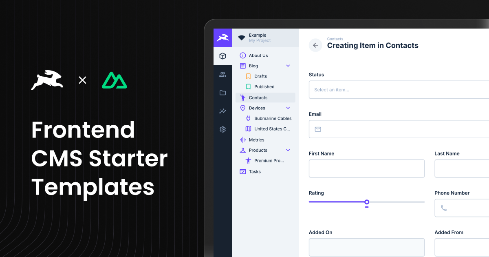

# Nuxt 4 CMS Template with Directus Integration & i18n Support

<div align="center">
  
</div>

This is a **Nuxt 4-based CMS Template with Internationalization (i18n) support** that is fully integrated with
[Directus](https://directus.io/), offering a CMS solution for managing and delivering multilingual content seamlessly.
The template leverages modern technologies like **Nuxt 4's file-based routing system**, **Tailwind CSS**, **Shadcn Vue
components**, and **built-in i18n support**, providing a complete and scalable starting point for building multilingual
CMS-powered web applications.

> **Note**: This is the i18n-enabled version of the Nuxt CMS template. For a single-language version, see the
> [standard Nuxt CMS template](../nuxt/README.md).

## **Features**

- **Nuxt 4 File-Based Routing**: Uses Nuxt's built-in routing system with dynamic page handling.
- **Internationalization (i18n)**: Built-in support for multiple languages with locale-based routing, automatic
  translation fetching from Directus, and language switcher component.
- **Full Directus Integration**: Directus API integration for fetching and managing relational data with translation
  support.
- **Locale-Aware Content**: Automatic content translation based on URL locale prefixes (e.g., `/en/`, `/es/`) with
  fallback to default locale.
- **Tailwind CSS**: Fully integrated for rapid UI styling.
- **TypeScript**: Ensures type safety and reliable code quality.
- **Shadcn Vue Components**: Pre-built, customizable UI components for modern design systems.
- **ESLint & Prettier**: Enforces consistent code quality and formatting.
- **Dynamic Page Builder**: A page builder interface for creating and customizing CMS-driven pages.
- **Preview Mode**: Built-in draft/live preview for editing unpublished content.
- **Optimized Dependency Management**: Project is set up with **pnpm** for faster and more efficient package management.

---

## **Draft Mode in Directus and Live Preview**

### **Draft Mode Overview**

Directus allows you to work on unpublished content using **Draft Mode**. This Nuxt 4 template is configured to support
Directus Draft Mode out of the box, enabling live previews of unpublished or draft content as you make changes.

### **Live Preview Setup**

[Directus Live Preview](https://docs.directus.io/guides/headless-cms/live-preview/nuxt-3.html#set-up-live-preview-with-nuxt-3)

- The live preview feature works seamlessly on deployed environments.
- To preview content on **localhost**, deploy your application to a staging environment.
- **Important Note**: Directus employs Content Security Policies (CSPs) that block live previews on `localhost` for
  security reasons. For a smooth preview experience, deploy the application to a cloud environment and use the
  deployment URL for Directus previews.

## **Internationalization (i18n)**

### **How It Works**

This template includes built-in internationalization support:

- **Locale-Based Routing**: URLs automatically include locale prefixes (e.g., `/en/about`, `/es/about`) with the default
  locale (en-US) using clean URLs without a prefix.
- **Directus Translation Integration**: Translations are stored in Directus `{collection}_translations` tables and
  automatically fetched based on the current locale.
- **Automatic Content Merging**: Translations are automatically merged onto base content objects, so components can use
  `item.title` directly without checking for translations.
- **Language Switcher**: Built-in `LanguageSwitcher` component for easy language selection.
- **SSR & Client Support**: Locale detection works on both server-side (via middleware) and client-side (via route
  detection).

### **Directus Setup for i18n**

The i18n schema (languages collection, translation tables, etc.) is included in the Directus template located in
`../directus/template/`. Apply it to your Directus instance using the
[Directus Template CLI](https://github.com/directus/template-cli):

```bash
npx directus-template-cli@latest apply <path-to-template>
```

---

## **Getting Started**

### Prerequisites

To set up this template, ensure you have the following:

- **Node.js** (20.x or newer)
- **pnpm** (8.6.0 or newer) or **npm**
- Access to a **Directus** instance ([cloud or self-hosted](../../README.md))

## ⚠️ Directus Setup Instructions

For instructions on setting up Directus, choose one of the following:

- [Setting up Directus Cloud](https://github.com/directus-labs/starters?tab=readme-ov-file#using-directus-with-a-cloud-instance-recommended)
- [Setting up Directus Self-Hosted](https://github.com/directus-labs/starters?tab=readme-ov-file#using-directus-locally)

## 🚀 One-Click Deploy

You can instantly deploy this template using one of the following platforms:

[](https://vercel.com/new/clone?repository-url=https://github.com/directus-labs/starters/tree/main/cms-i18n/nuxt&env=DIRECTUS_URL,NUXT_PUBLIC_SITE_URL,DIRECTUS_SERVER_TOKEN,NUXT_PUBLIC_ENABLE_VISUAL_EDITING)

[](https://app.netlify.com/start/deploy?repository=https://github.com/directus-labs/starters&branch=main&create_from_path=cms-i18n/nuxt)

### **Environment Variables**

To get started, you need to configure environment variables. Follow these steps:

1. **Copy the example environment file:**

   ```bash
   cp .env.example .env
   ```

2. **Update the following variables in your `.env` file:**

   - **`DIRECTUS_URL`**: URL of your Directus instance.
   - **`DIRECTUS_SERVER_TOKEN`**: Server-side token for accessing content, preview, and form submissions. Use the token
     from the **Webmaster** account.
   - **`DIRECTUS_ADMIN_TOKEN`**: Admin token for local type generation only. Never used at runtime.
   - **`NUXT_PUBLIC_SITE_URL`**: The public URL of your site. This is used for SEO metadata and blog post routing.
   - **`NUXT_PUBLIC_ENABLE_VISUAL_EDITING`**: Visual editing is enabled by default. Set to `false` to disable.

## **Running the Application**

### Local Development

1. Install dependencies:

   ```bash
   pnpm install
   ```

   _(You can also use `npm install` if you prefer.)_

   **Note for npm users:** This project uses pnpm workspaces. If you're using npm instead, you'll need to:
   ```bash
   rm -rf node_modules pnpm-lock.yaml
   npm install
   ```
   npm doesn't support pnpm's `workspace:` protocol, so you must remove `pnpm-lock.yaml` before running `npm install`. The project will generate a `package-lock.json` instead.

2. Start the development server:

   ```bash
   pnpm run dev
   ```

3. Visit [http://localhost:3000](http://localhost:3000).

## Generate Directus Types

This repository includes a [utility](https://www.npmjs.com/package/directus-sdk-typegen) to generate TypeScript types
for your Directus schema.

#### Usage

1. Ensure your `.env` file is configured as described above.
2. Run the following command:
   ```bash
   pnpm run generate:types
   ```

## Folder Structure

```
app/                          # Main Nuxt application folder
│
├── assets/                   # Static assets like images and stylesheets
│   ├── css/
│   ├── images/
│
├── components/               # Vue components
│   ├── base/                 # Common reusable base components
│   ├── block/                # CMS-driven blocks like Hero, Gallery, etc.
│   ├── forms/                # Form components and field inputs
│   │   ├── fields/
│   ├── shared/               # Shared utilities like DirectusImage
│   ├── ui/                   # Shadcn UI components
│   ├── Footer.vue
│   ├── NavigationBar.vue
│   ├── PageBuilder.vue       # Assembles CMS-driven blocks into pages
│
├── layouts/                  # Nuxt layouts for structuring pages
│   ├── default.vue
│
├── lib/                      # Utility functions and helper scripts
│   ├── zodSchemaBuilder.ts   # Schema validation with Zod
│
├── pages/
│   ├── blog/
│   │   ├── [slug].vue        # Dynamic blog post route
│   ├── [...permalink].vue    # Catch-all route for dynamic pages
│
├── public/                   # Publicly accessible assets
│   ├── icons/
│   ├── images/
│
├── scripts/
│   ├── generate-types.ts     # Script to generate Directus types
│
├── server/
│   ├── api/                  # API routes for interacting with Directus
│   │   ├── forms/submit.ts    # Handles form submissions
│   │   ├── posts/[slug]/index.ts  # Fetches individual posts
│   │   ├── search/index.ts    # Search functionality
│   │   ├── users/[id].ts      # Fetches user data
│   │   ├── authenticated-user.ts  # Auth check endpoint
│   ├── middleware/            # Server middleware
│   │   ├── locale.ts          # Locale detection and context setup
│   ├── utils/                 # Backend utilities
│   │   ├── directus-server.ts # Directus server-side utilities
│   │   ├── directus-utils.ts  # General Directus helpers
│   │   ├── directus-i18n.ts   # i18n-specific Directus utilities
│   │   ├── i18n.ts            # i18n helper functions
│   ├── shared/                # Shared backend logic
│   │   ├── types/schema.ts    # Directus schema types
├── middleware/                # Client-side middleware
│   ├── locale.global.ts       # Global locale middleware
├── app/
│   ├── lib/
│   │   ├── i18n/              # i18n configuration and utilities
│   │   │   ├── config.ts      # Locale configuration
│   │   │   ├── utils.ts       # Locale path utilities
│   ├── composables/
│   │   ├── useLocale.ts       # Locale composable for components
```
