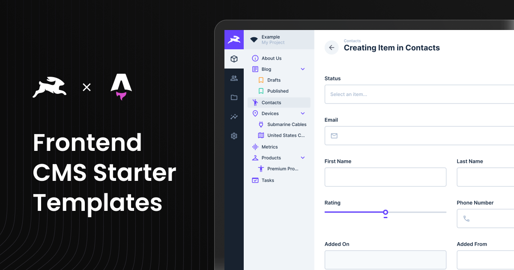

# Astro CMS Template with Directus Integration

<div align="center">
  
</div>

This is an **Astro-based CMS Template** that is fully integrated with [Directus](https://directus.io/), offering a CMS
solution for managing and delivering content seamlessly. It uses **Astro 6** with **file-based routing**, **Tailwind
CSS**, and **Shadcn-style components**, as a starting point for CMS-powered sites.

## **Features**

- **Astro File-based Routing**: Uses Astro's file-based routing for layouts and dynamic routes.
- **Full Directus Integration**: Directus API integration for fetching and managing relational data.
- **Tailwind CSS**: Fully integrated for rapid UI styling.
- **TypeScript**: Ensures type safety and reliable code quality.
- **Shadcn Components**: Pre-built, customizable UI components for modern design systems.
- **ESLint & Biome**: Linting and formatting.
- **Dynamic Page Builder**: A page builder interface for creating and customizing CMS-driven pages.
- **Preview Mode**: Built-in draft/live preview for editing unpublished content.
- **Optimized Dependency Management**: Project is set up with **pnpm** for faster and more efficient package management.

---

## **Draft Mode in Directus and Live Preview**

### **Draft Mode Overview**

Directus allows you to work on unpublished content using **Draft Mode**. This Astro template is configured to support
Directus Draft Mode out of the box, enabling live previews of unpublished or draft content as you make changes.

### **Live Preview Setup**

[Implementing Live Preview in Astro](https://directus.io/docs/tutorials/getting-started/implementing-live-preview-in-astro)

- The live preview feature works seamlessly on deployed environments.
- **For Local Development**: If using local Docker, the CSP configuration is provided in `.env.example`. See
  [`../../directus/README.md`](../../directus/README.md#content-security-policy-csp-and-preview-issues) for details.
- **For Directus Cloud**: Directus Cloud requires HTTPS for previews. You'll need to use HTTPS tunneling (ngrok,
  localtunnel, etc.) or configure CSP in your Directus Cloud settings. See the
  [main README troubleshooting section](../../README.md#preview-not-working---content-security-policy-csp-issues) for
  details.

---

## **Getting Started**

### Prerequisites

To set up this template, ensure you have the following:

- **Node.js** (see `.nvmrc` for the version used in this repo)
- **npm** or **pnpm**
- Access to a **Directus** instance ([cloud or self-hosted](../../README.md))

## ⚠️ Directus Setup Instructions

For instructions on setting up Directus, choose one of the following:

- [Setting up Directus Cloud](https://github.com/directus-labs/starters?tab=readme-ov-file#using-directus-with-a-cloud-instance-recommended)
- [Setting up Directus Self-Hosted](https://github.com/directus-labs/starters?tab=readme-ov-file#using-directus-locally)

## 🚀 One-Click Deploy

You can instantly deploy this template using Vercel:

[](https://vercel.com/new/clone?repository-url=https://github.com/directus-labs/starters/tree/main/cms/astro&env=PUBLIC_DIRECTUS_URL,PUBLIC_SITE_URL,DIRECTUS_SERVER_TOKEN,PUBLIC_ENABLE_VISUAL_EDITING)

> ⚡️ **This Astro starter is pre-configured for Vercel.**
>
> To deploy on Netlify:
>
> 1. Run: `pnpm add -D @astrojs/netlify`
> 2. In `astro.config.ts`, swap the adapter (see
>    [Netlify adapter docs](https://docs.astro.build/en/guides/integrations-guide/netlify/)):
>
>    ```ts
>    import netlify from '@astrojs/netlify';
>    // import vercel from '@astrojs/vercel';
>
>    export default defineConfig({
>      adapter: netlify(),
>    });
>    ```
>
> 3. Commit and redeploy manually.

### **Environment Variables**

To get started, you need to configure environment variables. Follow these steps:

1. **Copy the example environment file:**

   ```bash
   cp .env.example .env
   ```

2. **Update the following variables in your `.env` file:**

   - **`PUBLIC_DIRECTUS_URL`**: URL of your Directus instance.
   - **`DIRECTUS_SERVER_TOKEN`**: Token from the **Webmaster** account in Directus. Used server-side for preview, draft
     content, and form submissions.
   - **`DIRECTUS_ADMIN_TOKEN`**: Admin token for local type generation only. Never used at runtime.
   - **`PUBLIC_SITE_URL`**: The public URL of your site. This is used for SEO metadata and blog post routing.
   - **`PUBLIC_ENABLE_VISUAL_EDITING`**: Visual editing is enabled by default. Set to `false` to disable.

---

## **Running the Application**

### Local Development

1. Install dependencies:

   ```bash
   pnpm install
   ```

   _(You can also use `npm install` if you prefer.)_

   **Note for npm users:** Remove `pnpm-lock.yaml` (and optionally `node_modules`) if you want npm to generate its own
   lockfile, then run `npm install`.

2. Start the development server:

   ```bash
   pnpm run dev
   ```

3. Visit [http://localhost:3000](http://localhost:3000).

## **Generate Directus Types**

This repository includes a [utility](https://www.npmjs.com/package/directus-sdk-typegen) to generate TypeScript types
for your Directus schema.

#### Usage

1. Ensure your `.env` file is configured as described above.
2. Run the following command:

   ```bash
   pnpm run generate:types
   ```

3. When prompted, enter your Directus admin token (with permissions to read system collections like `directus_fields`),
   or set it ahead of time via the `DIRECTUS_ADMIN_TOKEN` environment variable for non-interactive runs (e.g., CI).

> **Note:** The type generation requires an admin token with permissions to read system collections like
> `directus_fields`. You can either provide the admin token interactively when prompted, or set it via the
> `DIRECTUS_ADMIN_TOKEN` environment variable (e.g., `DIRECTUS_ADMIN_TOKEN=your_token pnpm run generate:types`) to run
> without a TTY.

---

## **Folder Structure**

```
src/
├── components/                       # Reusable components
│   ├── blocks/                       # CMS blocks (Hero, Gallery, etc.)
│   │   ├── BaseBlock.tsx              # Handles all blocks for Directus visual editing
│   │   ├── Hero.tsx
│   │   ├── Gallery.tsx
│   │   ├── Posts.tsx
│   │   ├── Form.tsx
│   │   ├── Pricing.tsx               # Now a React component for visual editing
│   │   ├── PricingCard.tsx
│   │   ├── RichText.tsx              # Now a React component for visual editing
│   │   └── ButtonGroup.tsx
│   ├── forms/                        # Form components
│   │   ├── DynamicForm.tsx           # Renders dynamic forms with validation
│   │   ├── FormBuilder.tsx           # Manages form lifecycles and submission
│   │   ├── FormField.tsx             # Renders individual form fields dynamically
│   │   └── fields/                   # Form fields components
│   │       ├── CheckboxField.tsx
│   │       ├── CheckboxGroupField.tsx
│   │       ├── FileUploadField.tsx
│   │       ├── RadioGroupField.tsx
│   │       └── SelectField.tsx
│   ├── layout/                       # Layout components
│   │   ├── Footer.astro
│   │   ├── NavigationBar.tsx
│   │   └── PageBuilder.astro          # Assembles blocks into pages
│   ├── shared/                       # Shared utilities
│   │   └── DirectusImage.tsx         # Renders images from Directus
│   ├── ui/                           # Shadcn and other base UI components
│   │   ├── SearchModal.tsx
│   │   ├── ShareDialog.tsx
│   │   ├── Tagline.astro              # Static text block (Astro)
│   │   ├── Tagline.tsx                # React version for use in React components
│   │   ├── Headline.astro             # Static text block (Astro)
│   │   ├── Headline.tsx               # React version for use in React components
│   │   ├── Text.astro                 # Static text block (Astro)
│   │   ├── Text.tsx                   # React version for use in React components
│   │   ├── ThemeToggle.tsx            # Handles dark mode (React)
│   │   └── Container.tsx              # Base UI component
├── layouts/                          # Layout components for Astro pages
│   └── BaseLayout.astro
├── lib/                              # Utility and global logic
│   ├── directus/                     # Directus utilities
│   │   ├── directus-utils.ts         # General Directus helpers
│   │   ├── fetchers.ts               # API fetchers
│   │   ├── forms.ts                  # Directus form handling
│   │   ├── generateDirectusTypes.ts  # Generates Directus types
│   │   └── directus.ts               # Directus client setup
│   ├── utils.ts                      # Global utilities
│   └── zodSchemaBuilder.ts           # Zod validation schemas
├── pages/                            # Astro pages and endpoints
│   ├── api/                          # API endpoints for search
│   │   └── search.ts
│   ├── blog/                         # Blog-related pages
│   │   └── [slug].astro
│   ├── [...permalink].astro          # Dynamic page routes
│   ├── 404.astro
│   └── sitemap.xml.ts                # Sitemap generator
├── styles/                           # Global styles
│   ├── global.css
│   └── fonts.css
└── types/                            # TypeScript types
    └── directus-schema.ts            # Directus-generated types

```

## 📖 Component Structure in Astro & React

Our project is built with **Astro** for performance and **React** for interactivity. To optimize **server-side rendering
(SSR)** while keeping **interactive components responsive**, we use **both Astro (`.astro`) and React (`.tsx`)
components**, depending on their needs.

---

## 🛠️ Why Do We Have Two Versions of Some Components?

Some components exist in **both `.astro` and `.tsx` versions** to ensure they are used in the most efficient way:

- **Astro Components (`.astro`)** are used whenever a component is **static** and **doesn't need Directus visual
  editing** (e.g., `Footer.astro`).
- **React Components (`.tsx`)** are used when interactivity is needed or when the component needs to support Directus
  visual editing (e.g., `Gallery.tsx`, `Form.tsx`, `ThemeToggle.tsx`, `Pricing.tsx`).
- **If a component might be used inside both Astro and React**, we provide **both versions** (e.g., `Headline.astro` and
  `Headline.tsx`).

---

## 📌 Adding or Modifying Components

### ✅ Use Astro (`.astro`) when:

✔ The component is **purely static** (text, images, basic layouts).  
✔ It does **not require interactivity or client-side state**.  
✔ It is used inside other Astro components.  
✔ It **doesn't need Directus visual editing support**.

### ✅ Use React (`.tsx`) when:

✔ The component **requires client-side state, interactivity, or event listeners** (e.g., toggles, modals, forms).  
✔ It **depends on a React-based UI library** (e.g., `ShadCN`, `Lucide Icons`).  
✔ It needs to be **used inside a React component** (Astro cannot directly import React logic).  
✔ It **needs to support Directus visual editing**.

### ✅ Provide Both Astro & React Versions when:

✔ The component is mostly static **but might be used inside both Astro and React** (e.g., `Headline`, `Tagline`,
`Text`).  
✔ The component needs different rendering strategies depending on context.

---

## ✨ Key Takeaways

🔹 **Astro for non-visual editing components** → We use Astro when visual editing is not needed.  
🔹 **React for visual editing and interactivity** → Components that need Directus visual editing or client-side
interactivity.  
🔹 **Follow the structure** → If modifying or adding components:

- **Use Astro for static components that don't need visual editing.**
- **Use React for components that need visual editing or interactivity.**
- **If a component needs to be used in both contexts, create both versions.**

🚀 **This setup ensures compatibility with Directus visual editing while maintaining Astro's performance benefits where
possible!**

---

## 📌 When Adding a New Component:

- **Is it static and doesn't need visual editing?** → **Use `.astro`.**
- **Does it need interactivity or visual editing?** → **Use `.tsx`.**
- **Will it be used inside both React & Astro?** → **Create both versions.**
