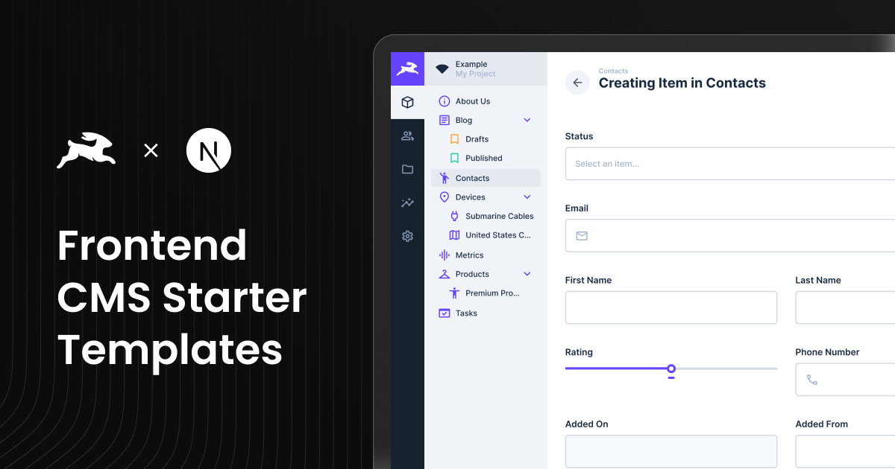

# Next.js CMS Template with Directus Integration

<div align="center">
  
</div>

This is a **Next.js-based CMS Template** that is fully integrated with [Directus](https://directus.io/), offering a CMS
solution for managing and delivering content seamlessly. The template leverages modern technologies like the **Next.js
App Router**, **Tailwind CSS**, and **Shadcn components**, providing a complete and scalable starting point for building
CMS-powered web applications.

## **Features**

- **Next.js App Router**: Uses the latest Next.js routing architecture for layouts and dynamic routes.
- **Full Directus Integration**: Directus API integration for fetching and managing relational data.
- **Tailwind CSS**: Fully integrated for rapid UI styling.
- **TypeScript**: Ensures type safety and reliable code quality.
- **Shadcn Components**: Pre-built, customizable UI components for modern design systems.
- **ESLint & Prettier**: Enforces consistent code quality and formatting.
- **Dynamic Page Builder**: A page builder interface for creating and customizing CMS-driven pages.
- **Preview Mode**: Built-in draft/live preview for editing unpublished content.
- **Optimized Dependency Management**: Project is set up with **pnpm** for faster and more efficient package management.

---

## **Draft Mode in Directus and Live Preview**

### **Draft Mode Overview**

Directus allows you to work on unpublished content using **Draft Mode**. This Next.js template is configured to support
Directus Draft Mode out of the box, enabling live previews of unpublished or draft content as you make changes.

### **Live Preview Setup**

[Directus Live Preview](https://docs.directus.io/guides/headless-cms/live-preview/nextjs.html)

- The live preview feature works seamlessly on deployed environments.
- **For Local Development**: If using local Docker, the CSP configuration is provided in `.env.example`. See [`../../directus/README.md`](../../directus/README.md#content-security-policy-csp-and-preview-issues) for details.
- **For Directus Cloud**: Directus Cloud requires HTTPS for previews. You'll need to use HTTPS tunneling (ngrok, localtunnel, etc.) or configure CSP in your Directus Cloud settings. See the [main README troubleshooting section](../../README.md#preview-not-working---content-security-policy-csp-issues) for details.

---

## **Getting Started**

### Prerequisites

To set up this template, ensure you have the following:

- **Node.js** (16.x or newer)
- **npm** or **pnpm**
- Access to a **Directus** instance ([cloud or self-hosted](../../README.md))

## ⚠️ Directus Setup Instructions

For instructions on setting up Directus, choose one of the following:

- [Setting up Directus Cloud](https://github.com/directus-labs/starters?tab=readme-ov-file#using-directus-with-a-cloud-instance-recommended)
- [Setting up Directus Self-Hosted](https://github.com/directus-labs/starters?tab=readme-ov-file#using-directus-locally)

## 🚀 One-Click Deploy

You can instantly deploy this template using one of the following platforms:

[](https://vercel.com/new/clone?repository-url=https://github.com/directus-labs/starters/tree/main/cms/nextjs&env=NEXT_PUBLIC_DIRECTUS_URL,NEXT_PUBLIC_SITE_URL,DIRECTUS_SERVER_TOKEN,NEXT_PUBLIC_ENABLE_VISUAL_EDITING)

[](https://app.netlify.com/start/deploy?repository=https://github.com/directus-labs/starters&branch=main&create_from_path=cms/nextjs)

### **Environment Variables**

To get started, you need to configure environment variables. Follow these steps:

1. **Copy the example environment file:**

   ```bash
   cp .env.example .env
   ```

2. **Update the following variables in your `.env` file:**

   - **`NEXT_PUBLIC_DIRECTUS_URL`**: URL of your Directus instance.
   - **`DIRECTUS_SERVER_TOKEN`**: Token from the **Webmaster** account in Directus. Used server-side for preview, draft content, and form submissions.
   - **`DIRECTUS_ADMIN_TOKEN`**: Admin token for local type generation only. Never used at runtime.
   - **`NEXT_PUBLIC_SITE_URL`**: The public URL of your site. This is used for SEO metadata and blog post routing.
   - **`NEXT_PUBLIC_ENABLE_VISUAL_EDITING`**: Visual editing is enabled by default. Set to `false` to disable.

## **Running the Application**

### Local Development

1. Install dependencies:

   ```bash
   pnpm install
   ```

   _(You can also use `npm install` if you prefer.)_

   **Note for npm users:** This project uses pnpm workspaces. If you're using npm instead, you'll need to:
   ```bash
   rm -rf node_modules pnpm-lock.yaml
   npm install
   ```
   npm doesn't support pnpm's `workspace:` protocol, so you must remove `pnpm-lock.yaml` before running `npm install`. The project will generate a `package-lock.json` instead.

2. Start the development server:

   ```bash
   pnpm run dev
   ```

3. Visit [http://localhost:3000](http://localhost:3000).

## Generate Directus Types

This repository includes a [utility](https://www.npmjs.com/package/directus-sdk-typegen) to generate TypeScript types
for your Directus schema.

#### Usage

1. Ensure your `.env` file is configured as described above.
2. Run the following command:
   ```bash
   pnpm run generate:types
   ```
3. When prompted, enter your Directus admin token (with permissions to read system collections like `directus_fields`), or set it ahead of time via the `DIRECTUS_ADMIN_TOKEN` environment variable for non-interactive runs (e.g., CI).

> **Note:** The type generation requires an admin token with permissions to read system collections like `directus_fields`. You can either provide the admin token interactively when prompted, or set it via the `DIRECTUS_ADMIN_TOKEN` environment variable (e.g., `DIRECTUS_ADMIN_TOKEN=your_token pnpm run generate:types`) to run without a TTY.

## Folder Structure

```
src/
├── app/                              # Next.js App Router and APIs
│   ├── blog/                         # Blog-related routes
│   │   ├── [slug]/                   # Dynamic blog post route
│   │   │   └── page.tsx
│   ├── [permalink]/                  # Dynamic page route
│   │   └── page.tsx
│   ├── api/                          # API routes for draft/live preview and search
│   │   ├── draft/                    # Routes for draft previews
│   │   │   └── route.ts
│   │   ├── search/                   # Routes for search functionality
│   │   │   └── route.ts
│   ├── layout.tsx                    # Shared layout for all routes
├── components/                       # Reusable components
│   ├── blocks/                       # CMS blocks (Hero, Gallery, etc.)
│   │   └── ...
│   ├── forms/                        # Form components
│   │   ├── DynamicForm.tsx           # Renders dynamic forms with validation
│   │   ├── FormBuilder.tsx           # Manages form lifecycles and submission
│   │   ├── FormField.tsx             # Renders individual form fields dynamically
│   │   └── fields/                   # Form fields components
│   │   └── ...
│   ├── layout/                       # Layout components
│   │   ├── Footer.tsx
│   │   ├── NavigationBar.tsx
│   │   └── PageBuilder.tsx           # Assembles blocks into pages
│   ├── shared/                       # Shared utilities
│   │   └── DirectusImage.tsx         # Renders images from Directus
│   ├── ui/                           # Shadcn and other base UI components
│   │   └── ...
├── lib/                              # Utility and global logic
│   ├── directus/                     # Directus utilities
│   │   ├── directus.ts               # Directus client setup
│   │   ├── fetchers.ts               # API fetchers
│   │   ├── forms.ts                  # Directus form handling
│   │   ├── generateDirectusTypes.ts  # Generates Directus types
│   │   └── directus-utils.ts         # General Directus helpers
│   ├── zodSchemaBuilder.ts           # Zod validation schemas
├── styles/                           # Global styles
│   └── ...
├── types/                            # TypeScript types
│   └── directus-schema.ts            # Directus-generated types
```

---
